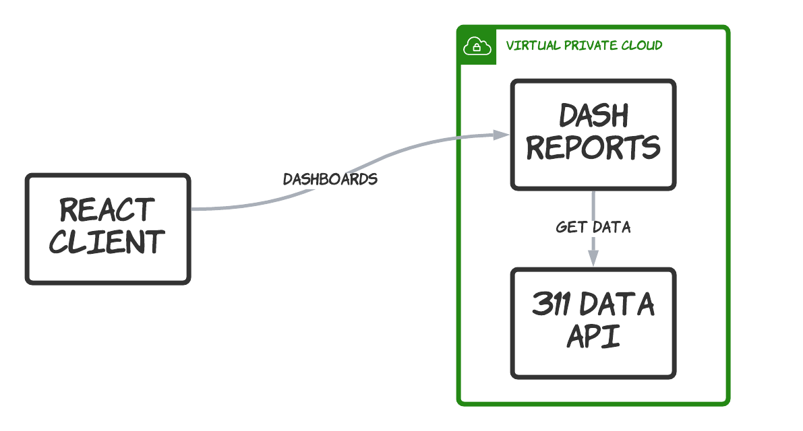

# Dash POC

This is a proof-of-concept for a reporting system to be used in the [311 Data project](https://311-data.org). It uses [Plotly Dash](https://dash.plotly.com/) to create reports using Python that run interactively in a browser.

## Why?

Creating reports with Dash has benefits:

- different layouts for each report
- fine-grained control over axes, grids, legends, etc.
- merge data from different sources
- leverage calculations and statistical tools
- use standard Pandas, Numpy and other python libraries

The main benefit however is the workflow.

With this approach we can have dedicated data analysts/scientists prototype reports in Jupyter notebooks using the Dash plug-in, get feedback/iterate, and package the report for inclusion in the app.

Changing reports, whether to fix bugs or respond to use feedback, no longer has to involve designers, frontend and backend developers running design, development and testing cycles. The data team should be able to control the report output themselves.

## How

Dash runs in a container deployed to AWS Lightsail. It makes calls to the 311 Data API ```/reports``` endpoint to get aggregated data about service requests.

Dash runs server-based logic to generate UI components in React such as graphs and dropdown menus that the user can interact with.

It runs as a single embedded Flask app and routes requests to a specific report based on the query string. The reports themselves are self-contained single files with the data and layouts needed by Dash.



## Challenges

There are many benefits described above but they come with some new challenges. Having a separate standalone app for reporting provides flexibility but also introduces some integration problems that need to be mitigated.

- Need to figure out the best way to include reports in client (e.g. iframe?)
- Need to figure out how the client is aware of what reports are available
- Need to see how closely the UI can match the designs and what UX may need to be adjusted
- Need to see if we need to include some caching or other performance enhancements in the Dash container
